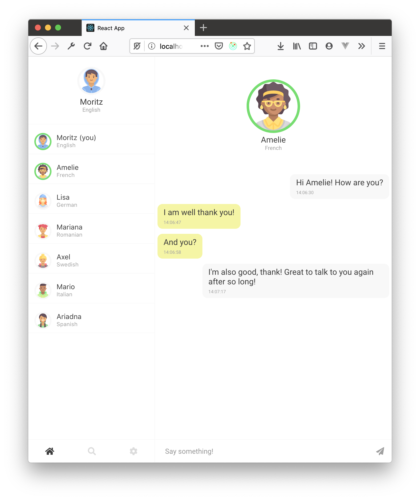

# PolyChat 2.0

## About

PolyChat is a chat application that supports real time translation of video and text messages using the Google Translate API.

The project was originally developed using JavaScript (Express) and React. This version aims to improve and expand the original design and was built with TypeScript, React, Redux and MongoDB.

## What it looks like

## Get Started

See the `README` files in the `client` and `backend` directory for more info.

Happy Hacking!
